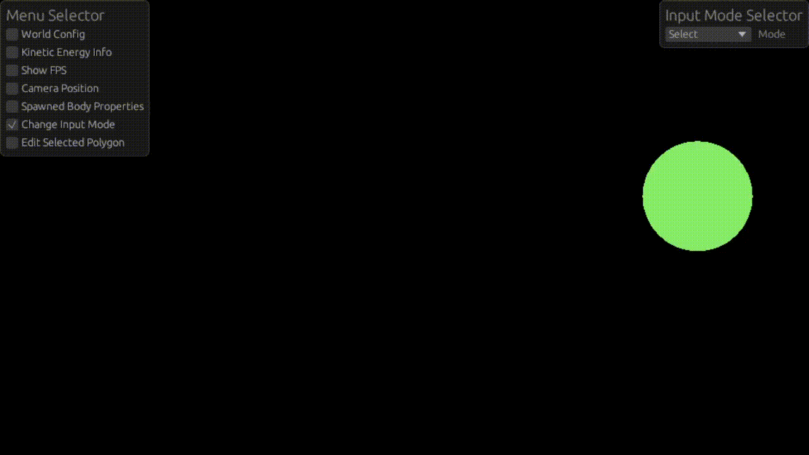

# Ferrum Physics Engine
A 2D physics engine written in Rust using wgpu and egui.

# Compilation
Install Rust
run the following command:
```
cargo build
```

# Running Examples
Examples can be run with the following command:
```
cargo run --example explosion
```
Where you replace pi with whichever example you wish to run. Examples can be 
found in /examples directory

# Controls

### Playing a simulation

To play a simulation you can either toggle the "Running" checkbox in the "World config" menu
or you can press "P".


### Camera Movement:
The camera can be moved in several ways
1. Pressing the middle mouse button and moving the cursor
2. Using the WASD keys
3. Using the arrow keys
4. Using the camera menu and changing the camera location


Additionally you can zoom in and out using the following methods
1. Using the + and - key
2. Using the scroll wheel
3. Using the camera position menu

It is important to note that you can change the speed at which you 
zoom in and out in the camera menu by changing the scroll speed option


### Spawning Objects
To spawn objects first you have to select the *Spawn* input mode in the 
input mode selector then there are three different ways to spawn a shape
1. Left click with the mouse to spawn a single shape
2. Press L to mass spawn shapes once a frame.

Additionally you can edit the properties of the objects you spawned by 
using the spawned body properties menu. This also allows you to select a type of
object,options being spring rectangle and regular polygon (default) 

Spawning with mouse:


Spawning with L:


To spawn a spring you first select the input mode *Spawn* then in the 
Spawned Bodies Properties menu you can select the Body Type spring.
To spawn the spring you click on one object then drag the spring to another object
this will connect a spring between the two object. To cancel spawning a spring let go
on the background instead of another object. Connecting a spring to a spring won't work
springs can only connect between polygons.

NOTE: Attempting to spawn a spring while the simulation is running will drag the object,
the spring is attached to. Additionally if in the "drag" mode then attempting to connect
two object with a spring will not work. To have a spring persist after letting go of the
left mouse button requires the "Spawn" input mode with the body type "Spring" selected.


### Editing spawned objects

To edit an already spawned object first in the "Input Mode Selector" menu choose the 
"Select/Deselect" mode then left click on the object you wanna edit and edit the properties using
the "Edit Selected Polygon" menu



### Dragging an object

To drag and object select the "Drag" input mode in the selector and then left click and drag the
object. Then a spring will appear and the object will be dragged towards your cursor

NOTE: If you only want to move an object it's better to simply select it and change its position
in the properties menu.


### World radius

You can edit the radius of the world in the "World Config" menu, all object outside of this radius
will despawn unless they have the eternal property enabled. A smaller world size leads to better 
performance, setting World radius to 0 will make the radius infinite.

Tip: Making the world radius value very small is a great way to clear the simulation


### Set all momentum to zero

By pressing M you can set all the objects in the world to have 0 velocity. This means 0 kinetic energy
which can be seen in the kinetic energy info menu


### Other options
Time step: Time step is the amount of seconds elapsed per frame, if this is set to 0 then the time step
is simply set to the amount of time it takes to process a frame. A lower value leads to a more accurate
simulation but runs slower. A higher values leads to an inaccurate simulation but rapid simulation

Physics updates per frame: Changes the amount of physics updates per frame. Speeds up the simulation but
reduces the fps. Useful for lower time step values.
WARNING: Setting a very large value will cause frames to take extremely long time to calculate and will likely
cause the program to hang.

Restitution/Bounciness: This value represents the amount of kinetic energy conserved after a bounce
0 means all energy is lost, 1 means all energy is conserved, a value above one means that the amount of
kinetic energy increases such as an explosion and a negative value would mean that an object would go through the other object
like a bullet would. Because objects are indestructible I decided to limit restitution values to be strictly positive,
however be warned that values over one can cause a continuous increase in momentum.

Gravity: You can toggle gravity on and off as well as changing the force of gravity (default is -9.81m/s^2)
and its direction. This value is two-dimensional first value is horizontal gravity and second is vertical gravity

Kinetic energy info: Displays the total amount of kinetic energy in the simulation.

